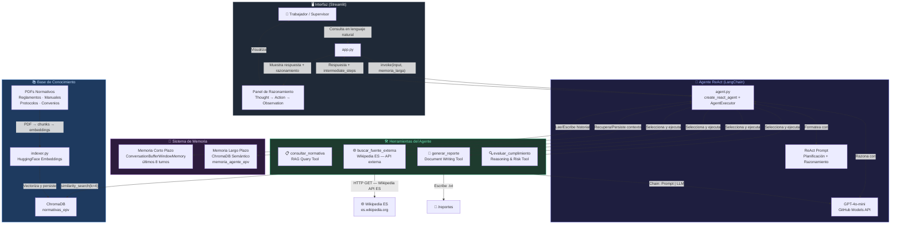
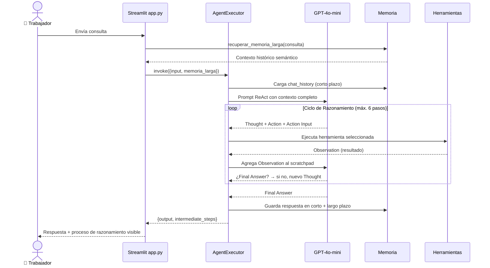

# 🚢 Agente Portuario EPV v2.0 — Informe Técnico Completo

**ISY0101 Ingeniería de Soluciones con Inteligencia Artificial**  
**DuocUC · Evaluación Parcial N°2 · 2026**

| Integrante | GitHub |
|---|---|
| Benjamin Aravena R. | [@PhamNukz](https://github.com/PhamNukz) |
| Francisco Gómez R. | [@FranciscoGomezRa](https://github.com/FranciscoGomezRa) |

---

## Índice

1. [Introducción](#1-introducción)
2. [Diseño y Arquitectura del Sistema](#2-diseño-y-arquitectura-del-sistema)
3. [Sistema de Memoria Dual](#3-sistema-de-memoria-dual)
4. [Planificación de Tareas y Razonamiento ReAct](#4-planificación-de-tareas-y-razonamiento-react)
5. [Herramientas del Agente](#5-herramientas-del-agente)
6. [Decisiones de Diseño](#6-decisiones-de-diseño)
7. [Instalación y Ejecución](#7-instalación-y-ejecución)
8. [Escenarios de Uso](#8-escenarios-de-uso)
9. [Cobertura de Indicadores de Evaluación](#9-cobertura-de-indicadores-de-evaluación)
10. [Referencias Bibliográficas](#10-referencias-bibliográficas)

---

## 1. Introducción

El **Agente Portuario EPV v2.0** es la segunda fase del proyecto iniciado en EP1. Extiende el chatbot RAG hacia un **agente funcional autónomo** implementando el patrón **ReAct** (Reasoning + Acting), con memoria persistente y conexión a fuentes de datos externas.

### Contexto Organizacional

El Puerto de Valparaíso (EPV) requiere que supervisores y operadores puedan:
- Consultar normativas y reglamentos operacionales
- Evaluar situaciones de riesgo en tiempo real
- Generar documentación formal sin depender de personal especializado
- Acceder a contexto normativo internacional (SOLAS, MARPOL, ISO, OIT)

### Diferencias clave respecto a EP1

| Dimensión | EP1 (Asistente) | EP2 (Agente) |
|---|---|---|
| Arquitectura | Cadena fija RAG | Agente ReAct dinámico |
| Herramientas | Solo RAG | 4 herramientas especializadas |
| Memoria | Sin memoria entre sesiones | Dual: corto + largo plazo |
| Fuentes de datos | Solo PDFs internos | Interna (ChromaDB) + Externa (Wikipedia ES) |
| Planificación | Ninguna | ReAct: hasta 6 pasos adaptativos |
| Interfaz | Chat simple | Chat + panel de razonamiento visible |

---

## 2. Diseño y Arquitectura del Sistema

### Diagrama de Orquestación



### Diagrama de Flujo ReAct



### Estructura del Repositorio

```
EP2_agente_portuario/
├── src/
│   ├── tools/
│   │   ├── __init__.py
│   │   ├── consulta_tool.py          # Herramienta RAG (normativas internas)
│   │   ├── escritura_tool.py         # Herramienta de generación de reportes
│   │   ├── razonamiento_tool.py      # Herramienta de evaluación de cumplimiento
│   │   └── busqueda_externa_tool.py  # Herramienta fuente externa (Wikipedia ES API)
│   ├── memory/
│   │   ├── __init__.py
│   │   ├── short_term.py             # Memoria corto plazo (ventana k=8)
│   │   └── long_term.py              # Memoria largo plazo (ChromaDB semántico)
│   ├── agent.py                      # Agente ReAct principal (AgentExecutor)
│   ├── app.py                        # Interfaz Streamlit
│   └── indexer.py                    # Indexador de PDFs → ChromaDB
├── documentos/                       # PDFs de normativas EPV
├── chroma_db/                        # Base vectorial de normativas (generada)
├── chroma_db_memoria_larga/          # Memoria semántica del agente (generada)
├── reportes/                         # Reportes generados por el agente
├── Informe_EP2_ISY0101.docx          # Informe técnico Word
├── requirements.txt
├── .env.example
└── README.md
```

---

## 3. Sistema de Memoria Dual

El sistema implementa dos niveles de memoria que operan en paralelo:

### 3.1 Memoria de Corto Plazo (`memory/short_term.py`)

```python
from langchain.memory import ConversationBufferWindowMemory

def crear_memoria_corto_plazo(k: int = 8) -> ConversationBufferWindowMemory:
    return ConversationBufferWindowMemory(
        k=k,                          # Últimas 8 interacciones
        memory_key="chat_history",    # Placeholder en el prompt
        return_messages=False,        # Formato texto plano
        input_key="input",
        output_key="output",
    )
```

- **Implementación:** `ConversationBufferWindowMemory(k=8)`
- **Alcance:** Sesión actual (se pierde al reiniciar)
- **Inyección:** Variable `{chat_history}` en el prompt ReAct
- **Objetivo:** Coherencia dentro de una sesión sin saturar el contexto

### 3.2 Memoria de Largo Plazo (`memory/long_term.py`)

```python
from langchain_chroma import Chroma
from langchain_huggingface import HuggingFaceEmbeddings

CHROMA_PATH  = "../chroma_db_memoria_larga"
COLECCION    = "memoria_agente_epv"

def guardar_en_memoria_larga(texto: str, tipo: str = "conversacion") -> None:
    """Persiste un intercambio como embedding en ChromaDB."""
    vectorstore = Chroma(persist_directory=CHROMA_PATH, ...)
    vectorstore.add_texts([texto], metadatas=[{"tipo": tipo}])

def recuperar_memoria_larga(consulta: str, k: int = 3) -> str:
    """Recupera los k intercambios más similares semánticamente."""
    vectorstore = Chroma(persist_directory=CHROMA_PATH, ...)
    docs = vectorstore.similarity_search(consulta, k=k)
    return "\n---\n".join(d.page_content for d in docs)
```

- **Implementación:** ChromaDB + HuggingFace `paraphrase-multilingual-MiniLM-L12-v2`
- **Alcance:** Persiste entre sesiones (archivo `chroma.sqlite3`)
- **Búsqueda:** Similitud vectorial (semántica)
- **Inyección:** Variable `{memoria_larga}` en el prompt ReAct

### Comparativa

| Dimensión | Corto Plazo | Largo Plazo |
|---|---|---|
| Implementación | `ConversationBufferWindowMemory` | ChromaDB + Embeddings |
| Alcance | Sesión actual (k=8 turnos) | Entre sesiones (persistente) |
| Búsqueda | Secuencial (posición) | Semántica (similitud vectorial) |
| Volatilidad | Se borra al reiniciar | Persiste indefinidamente |
| Inyección en prompt | `{chat_history}` | `{memoria_larga}` |

---

## 4. Planificación de Tareas y Razonamiento ReAct

### 4.1 Prompt ReAct (fragmento de `agent.py`)

```
Thought: [Analiza la tarea. ¿Qué herramienta es más adecuada? ¿Necesito más de un paso?]
Action: [nombre_exacto_de_la_herramienta]
Action Input: [input preciso para la herramienta]
Observation: [resultado de la herramienta]
... (repite hasta tener toda la información necesaria)
Thought: Tengo suficiente información para dar una respuesta completa.
Final Answer: [Respuesta final en español, citando fuentes si aplica]
```

### 4.2 Reglas de Planificación

El prompt incluye reglas explícitas que guían la selección y secuenciación de herramientas:

```
- Tarea simple          → 1 herramienta directamente
- Consultar + Evaluar   → consultar_normativa → evaluar_cumplimiento
- Consultar + Documentar → consultar_normativa → generar_reporte
- Incidente             → evaluar_cumplimiento → generar_reporte
- Contexto internacional → buscar_fuente_externa
- Interna + Externa     → consultar_normativa → buscar_fuente_externa
- Máximo 6 pasos por tarea
```

### 4.3 Configuración del AgentExecutor

```python
agent = create_react_agent(llm=llm, tools=herramientas, prompt=REACT_PROMPT)

executor = AgentExecutor(
    agent=agent,
    tools=herramientas,
    memory=memoria_corto_plazo,
    verbose=True,               # Expone el proceso interno
    handle_parsing_errors=True, # Tolerante a errores de formato
    max_iterations=6,           # Máximo 6 pasos por consulta
    return_intermediate_steps=True,  # Retorna Thought/Action/Observation
)
```

---

## 5. Herramientas del Agente

### 5.1 `consultar_normativa` — RAG interno

```python
@tool
def consultar_normativa(consulta: str) -> str:
    """
    Consulta la base de datos de normativas y reglamentos del Puerto de Valparaíso.
    Usa RAG con ChromaDB + HuggingFace embeddings (similarity_search k=4).
    """
    retriever = _cargar_retriever()
    docs = retriever.invoke(consulta)
    fragmentos = [
        f"[Fragmento {i} | Fuente: {doc.metadata.get('fuente')}]\n{doc.page_content}"
        for i, doc in enumerate(docs, 1)
    ]
    return "\n\n---\n\n".join(fragmentos)
```

- **Tipo de fuente:** Interna (ChromaDB local)
- **Embeddings:** `paraphrase-multilingual-MiniLM-L12-v2`
- **Recuperación:** `similarity_search(k=4)` — 4 fragmentos más relevantes
- **Metadatos:** Cada fragmento incluye el nombre del PDF de origen

### 5.2 `generar_reporte` — Escritura formal

```python
@tool
def generar_reporte(especificacion: str) -> str:
    """
    Genera y guarda un documento formal EPV (reporte, memo, acta).
    Recibe JSON: {"tipo": "MEMO", "titulo": "...", "contenido": "..."}
    """
    datos = json.loads(especificacion)
    timestamp = datetime.now().strftime("%Y%m%d_%H%M%S")
    nombre_archivo = f"{datos['tipo']}_{timestamp}.txt"
    # Escribe con cabecera EPV oficial + contenido
    with open(ruta, "w", encoding="utf-8") as f:
        f.write(cabecera_epv + datos["contenido"])
    return f"Documento guardado: {nombre_archivo}"
```

- **Tipo de fuente:** Interna (archivo `.txt` en `/reportes`)
- **Tipos soportados:** REPORTE, MEMO, ACTA, INFORME
- **Formato:** Cabecera oficial EPV + contenido + timestamp

### 5.3 `evaluar_cumplimiento` — Razonamiento normativo

```python
@tool
def evaluar_cumplimiento(situacion: str) -> str:
    """
    Analiza una situación y determina nivel de riesgo normativo (Bajo/Medio/Alto/Crítico).
    Usa una cadena LLM con prompt estructurado de evaluación técnica.
    """
    chain = prompt_evaluacion | llm | StrOutputParser()
    return chain.invoke({"situacion": situacion})
```

- **Tipo de fuente:** Interna (cadena `Prompt | ChatOpenAI`)
- **Niveles de riesgo:** Bajo / Medio / Alto / Crítico
- **Output:** Dictamen técnico + normativas involucradas + recomendaciones

### 5.4 `buscar_fuente_externa` — Wikipedia ES API *(fuente externa)*

```python
@tool
def buscar_fuente_externa(consulta: str) -> str:
    """
    Busca en Wikipedia ES en tiempo real (fuente externa — sin API key).
    Retorna resumen del artículo más relevante + URL de origen.
    """
    # 1. Buscar título más relevante
    r = requests.get("https://es.wikipedia.org/w/api.php", params={
        "action": "opensearch", "search": consulta,
        "limit": 3, "namespace": 0, "format": "json"
    }, timeout=8)
    titulo = r.json()[1][0]  # Primer resultado

    # 2. Obtener resumen del artículo
    r2 = requests.get(f"https://es.wikipedia.org/api/rest_v1/page/summary/{titulo}")
    datos = r2.json()

    return (
        f"[Fuente externa — Wikipedia ES]\n"
        f"Artículo: {datos['title']}\n"
        f"URL: {datos['content_urls']['desktop']['page']}\n\n"
        f"{datos['extract'][:1200]}"
    )
```

- **Tipo de fuente:** **Externa** (API REST pública — `es.wikipedia.org`)
- **Sin API key:** Acceso libre y gratuito
- **Endpoint 1:** `https://es.wikipedia.org/w/api.php` (búsqueda)
- **Endpoint 2:** `https://es.wikipedia.org/api/rest_v1/page/summary/{título}` (contenido)
- **Trazabilidad:** Retorna URL del artículo fuente

**Ejemplos de consultas útiles para el contexto portuario:**

| Query | Artículo Wikipedia retornado |
|---|---|
| `SOLAS` | Convenio Internacional para la Seguridad de la Vida Humana en el Mar |
| `MARPOL` | Convenio Internacional para Prevenir la Contaminación por los Buques |
| `equipo proteccion personal` | Equipo de protección individual |
| `transporte maritimo` | Transporte marítimo |
| `Puerto de Valparaíso` | Puerto de Valparaíso |

---

## 6. Decisiones de Diseño

### 6.1 ¿Por qué LangChain Agents y ReAct?

LangChain 0.3.25 fue seleccionado por continuidad con EP1 y por su integración nativa con ChromaDB, HuggingFace y la API de OpenAI. `create_react_agent` reemplaza el `AgentType.ZERO_SHOT_REACT_DESCRIPTION` obsoleto.

El patrón **ReAct** (Yao et al., 2023) permite:
- Razonar **antes** de actuar (Thought → Action → Observation)
- Planificación **adaptativa** de múltiples pasos
- Exposición del proceso interno (`verbose=True`) para auditoría

### 6.2 ¿Por qué memoria dual?

| Problema | Solución |
|---|---|
| Memoria de buffer ilimitada → satura el contexto del LLM | Ventana `k=8` |
| Ventana → pierde información entre sesiones | ChromaDB semántico persistente |
| Cargar todo el historial → costo excesivo de tokens | `similarity_search(k=3)` — solo lo relevante |

### 6.3 ¿Por qué Wikipedia como fuente externa?

EP1 fue evaluado con 80% en el indicador de fuentes externas porque el sistema solo usaba PDFs locales. Para EP2:

- **Acceso libre:** sin API key, sin costo
- **Relevancia:** artículos verificados sobre SOLAS, MARPOL, OIT, ISO 45001
- **Verificabilidad:** cada resultado incluye URL del artículo fuente
- **Extensibilidad:** el mismo patrón `@tool` + `requests` permite integrar en el futuro APIs como Directemar, OpenAlex o Regulación.cl

### 6.4 ¿Por qué GPT-4o-mini via GitHub Models?

- **Gratuito:** acceso vía GitHub Models con el mismo `GITHUB_TOKEN` de EP1
- **Consistencia:** mismas credenciales y configuración entre evaluaciones
- **Capacidad:** sigue el formato ReAct con alta fidelidad con `temperature=0.2`

---

## 7. Instalación y Ejecución

### 7.1 Requisitos

```
langchain==0.3.25
langchain-openai==0.3.19
langchain-huggingface==0.1.2
langchain-community==0.3.24
langchain-chroma==0.2.4
chromadb>=1.0.9
streamlit==1.44.0
python-dotenv==1.0.1
pypdf==5.4.0
sentence-transformers==3.3.1
openai==1.77.0
```

### 7.2 Instalación

```bash
# 1. Clonar el repositorio
git clone https://github.com/PhamNukz/Ingenier-a-de-Soluciones-con-Inteligencia-Artificial.git
cd EP2_agente_portuario

# 2. Crear entorno virtual
python -m venv venv
venv\Scripts\activate        # Windows
# source venv/bin/activate   # macOS/Linux

# 3. Instalar dependencias
pip install -r requirements.txt
```

### 7.3 Configuración

Crear archivo `.env` en la raíz del repositorio:

```env
GITHUB_TOKEN=tu_github_token_aqui
GITHUB_BASE_URL=https://models.inference.ai.azure.com
```

### 7.4 Indexar documentos (primera vez)

```bash
cd EP2_agente_portuario/src
python indexer.py
```

### 7.5 Ejecutar la aplicación

```bash
cd EP2_agente_portuario/src

# Interfaz web (recomendado)
python -m streamlit run app.py

# Modo consola (para pruebas)
python agent.py
```

Abre el navegador en: **http://localhost:8501**

---

## 8. Escenarios de Uso

### Escenario 1 — Consulta simple (1 herramienta)
```
Entrada:      "¿Cuáles son los EPP obligatorios en el muelle?"
Herramienta:  consultar_normativa
Resultado:    Normativa citada con nombre del PDF de origen
```

### Escenario 2 — Evaluación de riesgo (1 herramienta de razonamiento)
```
Entrada:      "Se observó que 3 operadores trabajan sin casco en zona de descarga nocturna"
Herramienta:  evaluar_cumplimiento
Resultado:    Dictamen técnico → Nivel de riesgo: ALTO
              Recomendación: paralización inmediata de operaciones
```

### Escenario 3 — Tarea multi-paso (2 herramientas)
```
Entrada:      "Consulta las normas de EPP y genera un memo de cumplimiento"
Herramientas: consultar_normativa → generar_reporte
Resultado:    [Paso 1] Recupera normativa EPP desde ChromaDB
              [Paso 2] Redacta y guarda MEMO_<timestamp>.txt en /reportes
```

### Escenario 4 — Reporte de incidente (2 herramientas, condición cambiante)
```
Entrada:      "Redacta un reporte del incidente: caída de contenedor en Muelle 3 a las 14:30"
Herramientas: evaluar_cumplimiento → generar_reporte
Resultado:    [Paso 1] Evalúa gravedad → Nivel CRÍTICO
              [Paso 2] Genera REPORTE_<timestamp>.txt con dictamen técnico
```

### Escenario 5 — Fuente externa en tiempo real
```
Entrada:      "¿Qué dice Wikipedia sobre el convenio SOLAS?"
Herramienta:  buscar_fuente_externa
Resultado:    Artículo: "Convenio Internacional para la Seguridad de la Vida Humana en el Mar"
              URL: https://es.wikipedia.org/wiki/Convenio_Internacional_...
              (Contenido del artículo en tiempo real desde Wikipedia ES)
```

---

## 9. Cobertura de Indicadores de Evaluación

| IE | Descripción | Implementación | Archivo(s) |
|---|---|---|---|
| **IE1** | Configurar herramientas del agente | 4 herramientas con `@tool` decorator | `tools/consulta_tool.py`, `escritura_tool.py`, `razonamiento_tool.py`, `busqueda_externa_tool.py` |
| **IE2** | Integrar frameworks adecuados | LangChain 0.3.25 + `create_react_agent` + `AgentExecutor` + LangChain Community/Chroma/HuggingFace | `agent.py`, `requirements.txt` |
| **IE3** | Memoria de contenido | `ConversationBufferWindowMemory(k=8)` — últimos 8 turnos de la sesión activa | `memory/short_term.py` |
| **IE4** | Recuperación de contexto semántico | ChromaDB + HuggingFace embeddings — `similarity_search(k=3)` entre sesiones | `memory/long_term.py` |
| **IE5** | Planificación de tareas | Prompt ReAct con 6 reglas de priorización — hasta 6 pasos adaptativos por consulta | `agent.py` (REACT_PROMPT) |
| **IE6** | Toma de decisiones con ejemplos | 5 escenarios documentados con herramientas y comportamientos distintos | Este documento + `README.md` |
| **IE7** | Diagrama + README | Diagramas Mermaid (graph TB + sequenceDiagram) + estructura del repositorio | `README.md` |
| **IE8** | Justificación de componentes | 4 decisiones de diseño justificadas (ReAct, memoria dual, fuente externa, GPT-4o-mini) | Sección 6 de este documento |
| **IE9** | Informe técnico + diagramas | Documento completo con 8 secciones, tablas comparativas y diagramas | `Informe_EP2_ISY0101.docx` + este `.md` |
| **IE10** | Lenguaje técnico con evidencia | Terminología técnica (ReAct, RAG, embedding, similarity_search, ChromaDB, ConversationBufferWindowMemory) con referencias APA | Todo el documento |

---

## 10. Referencias Bibliográficas

Chase, H. (2022). *LangChain [Software]*. GitHub. https://github.com/hwchase17/langchain

Chroma. (2024). *Chroma: The AI-native open-source embedding database*. https://docs.trychroma.com/

Gao, Y., Xiong, Y., Gao, X., Jia, K., Pan, J., Bi, Y., Dai, Y., Sun, J., & Wang, H. (2023). Retrieval-augmented generation for large language models: A survey. *arXiv preprint arXiv:2312.10997*. https://arxiv.org/abs/2312.10997

LangChain. (2024). *LangChain documentation: Agents*. https://python.langchain.com/docs/modules/agents/

OpenAI. (2024). *GitHub Models: Access AI models directly from GitHub*. https://github.com/marketplace/models

Reimers, N., & Gurevych, I. (2019). Sentence-BERT: Sentence embeddings using Siamese BERT-networks. *Proceedings of the 2019 Conference on Empirical Methods in Natural Language Processing*. https://arxiv.org/abs/1908.10084

Wikimedia Foundation. (2024). *Wikipedia REST API*. https://en.wikipedia.org/api/rest_v1/

Yao, S., Zhao, J., Yu, D., Du, N., Shafran, I., Narasimhan, K., & Cao, Y. (2023). ReAct: Synergizing reasoning and acting in language models. *International Conference on Learning Representations (ICLR 2023)*. https://arxiv.org/abs/2210.03629

---

*ISY0101 Ingeniería de Soluciones con Inteligencia Artificial — DuocUC 2026*  
*Benjamin Aravena R. · Francisco Gómez R.*
