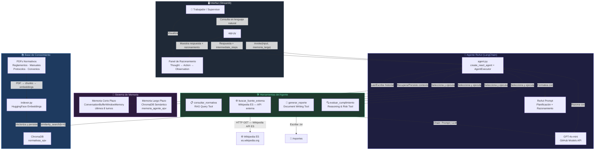
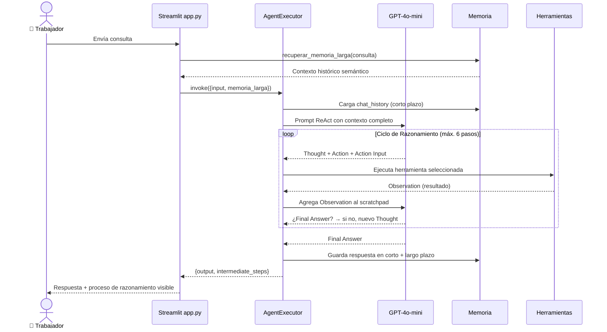

# 🚢 Agente Portuario EPV v2.0

**Evaluación Parcial N°2 — ISY0101 Ingeniería de Soluciones con IA**  
**DuocUC · 2026**

| Integrante | GitHub |
|---|---|
| Benjamin Aravena R. | [@PhamNukz](https://github.com/PhamNukz) |
| Francisco Gómez R. | — |

---

## 📋 Descripción

El **Agente Portuario EPV v2.0** es la segunda fase del proyecto iniciado en la EP1. Extiende el chatbot RAG desarrollado anteriormente hacia un **agente funcional autónomo** con capacidad de:

- **Consultar** normativas operacionales y de seguridad del Puerto de Valparaíso usando RAG
- **Evaluar** situaciones de cumplimiento normativo con análisis de riesgo estructurado
- **Generar** reportes formales, memos y actas en formato portuario oficial
- **Planificar** tareas de múltiples pasos de forma adaptativa (patrón ReAct)
- **Recordar** el contexto de la conversación actual y de sesiones anteriores

**Contexto organizacional:** El Puerto de Valparaíso (EPV) requiere que supervisores y trabajadores puedan consultar normativas, evaluar situaciones de riesgo y generar documentación formal de forma rápida y autónoma, sin depender de personal especializado disponible en todo momento.

---

## 🏗 Arquitectura del Sistema

### Diagrama de Orquestación de Componentes



### Diagrama de Flujo del Proceso ReAct



---

## 📦 Estructura del Repositorio

```
EP2_agente_portuario/
├── src/
│   ├── tools/
│   │   ├── __init__.py
│   │   ├── consulta_tool.py        # Herramienta RAG (consulta normativas internas)
│   │   ├── escritura_tool.py       # Herramienta de generación de reportes
│   │   ├── razonamiento_tool.py    # Herramienta de evaluación de cumplimiento
│   │   └── busqueda_externa_tool.py # Herramienta de fuente externa (Wikipedia ES API)
│   ├── memory/
│   │   ├── __init__.py
│   │   ├── short_term.py           # Memoria de corto plazo (ventana k=8)
│   │   └── long_term.py            # Memoria de largo plazo (ChromaDB semántico)
│   ├── agent.py                    # Agente ReAct principal (AgentExecutor)
│   ├── app.py                      # Interfaz Streamlit
│   └── indexer.py                  # Indexador de PDFs → ChromaDB
├── documentos/                     # PDFs de normativas EPV (copiar desde EP1)
├── chroma_db/                      # Base vectorial de normativas (generada)
├── chroma_db_memoria_larga/        # Memoria semántica del agente (generada)
├── reportes/                       # Reportes generados por el agente
├── requirements.txt
├── .env.example
└── README.md
```

---

## ⚙️ Instalación y Configuración

### 1. Clonar el repositorio

```bash
git clone https://github.com/PhamNukz/Ingenier-a-de-Soluciones-con-Inteligencia-Artificial.git
cd EP2_agente_portuario
```

### 2. Crear entorno virtual e instalar dependencias

```bash
python -m venv venv

# Windows
venv\Scripts\activate

# macOS/Linux
source venv/bin/activate

pip install -r requirements.txt
```

### 3. Configurar variables de entorno

Crear el archivo `.env` en la **raíz del repositorio** (mismo `.env` que EP1):

```env
GITHUB_TOKEN=tu_github_token_aqui
GITHUB_BASE_URL=https://models.inference.ai.azure.com
```

> 💡 Obtén tu token en: [GitHub Settings → Developer Settings → Personal Access Tokens](https://github.com/settings/tokens)

### 4. Preparar documentos

Copia los PDF de normativas desde EP1 a la carpeta `documentos/`:

```bash
# Desde la raíz del repositorio
cp EP1_asistente_portuario/documentos/*.pdf EP2_agente_portuario/documentos/
```

### 5. Indexar documentos (solo la primera vez)

```bash
cd EP2_agente_portuario/src
python indexer.py
```

---

## 🚀 Ejecución

### Interfaz Web (recomendado)

```bash
cd EP2_agente_portuario/src
streamlit run app.py
```

Abre tu navegador en: **http://localhost:8501**

### Modo Consola (para pruebas)

```bash
cd EP2_agente_portuario/src
python agent.py
```

---

## 🧪 Ejemplos de Uso y Pruebas

### Escenario 1 — Consulta simple (1 herramienta)
```
Entrada: "¿Cuáles son los equipos de protección personal obligatorios en el muelle?"
Herramienta: consultar_normativa
Comportamiento: El agente consulta la base vectorial y cita la fuente normativa.
```

### Escenario 2 — Evaluación de riesgo (1 herramienta de razonamiento)
```
Entrada: "Se observó que 3 operadores trabajan sin casco en zona de descarga nocturna"
Herramienta: evaluar_cumplimiento
Comportamiento: El agente emite un dictamen técnico con nivel de riesgo ALTO
                y recomendaciones de acción INMEDIATA.
```

### Escenario 3 — Tarea multi-paso (2 herramientas, planificación)
```
Entrada: "Consulta las normas de EPP y luego genera un memo de cumplimiento"
Herramientas: consultar_normativa → generar_reporte
Comportamiento: El agente primero consulta, luego usa la información para
                generar un documento formal y guardarlo en /reportes.
```

### Escenario 4 — Reporte de incidente completo (2 herramientas, condición cambiante)
```
Entrada: "Redacta un reporte del incidente: caída de contenedor en Muelle 3 hoy a las 14:30"
Herramientas: evaluar_cumplimiento → generar_reporte
Comportamiento: El agente evalúa la gravedad del incidente, determina las
                normativas involucradas y genera el reporte formal.
```

### Escenario 5 — Consulta de fuente externa (Wikipedia ES — API en tiempo real)
```
Entrada: "¿Qué dice Wikipedia sobre el convenio SOLAS de seguridad marítima?"
Herramienta: buscar_fuente_externa
Comportamiento: El agente realiza una llamada HTTP a la API REST de Wikipedia ES
                en tiempo real y retorna el resumen del artículo con su URL de origen.
                Ejemplo de combinación: consultar_normativa (normativa interna EPV)
                → buscar_fuente_externa (contexto internacional complementario)
```

---

## 🔧 Decisiones de Diseño

### ¿Por qué LangChain Agents?
- **Continuidad con EP1**: ya teníamos LangChain como base en el RAG chain
- **Escalabilidad**: permite agregar nuevas herramientas sin modificar el núcleo del agente
- **Compatibilidad**: integración nativa con ChromaDB, HuggingFace y OpenAI/GitHub Models

### ¿Por qué el patrón ReAct?
- Permite al agente **razonar antes de actuar** (Thought → Action → Observation)
- Soporta tareas de múltiples pasos con **decisiones adaptativas**
- El `verbose=True` expone el proceso interno para la interfaz de razonamiento

### ¿Por qué dos niveles de memoria?
- **Corto plazo** (`ConversationBufferWindowMemory`): acceso rápido al hilo actual de la conversación, esencial para coherencia dentro de una sesión
- **Largo plazo** (ChromaDB semántico): recuperación por similitud vectorial entre sesiones, permite que el agente "recuerde" interacciones pasadas relevantes sin sobrecargar el contexto

### ¿Por qué Wikipedia como fuente de datos externa?
- **Acceso libre**: API REST pública sin API key, sin costo, sin límite de uso para este contexto
- **Relevancia**: Wikipedia ES contiene artículos sobre convenios SOLAS, MARPOL, OIT, ISO que complementan la normativa interna EPV
- **Verificabilidad**: cada resultado incluye la URL del artículo original para trazabilidad
- **Arquitectura mixta**: combina fuente interna (ChromaDB + PDFs EPV) con fuente externa (Wikipedia API) en un mismo agente, evitando el acoplamiento a APIs de pago

### ¿Por qué GPT-4o-mini via GitHub Models?
- **Consistencia con EP1**: mismas credenciales y configuración
- **Costo cero**: acceso gratuito a través de GitHub Models
- **Capacidad suficiente**: modelo capaz de seguir el formato ReAct con alta fidelidad

---

## 📚 Referencias Bibliográficas

LangChain. (2024). *LangChain documentation: Agents*. https://python.langchain.com/docs/modules/agents/

Chase, H. (2022). *LangChain [Software]*. GitHub. https://github.com/hwchase17/langchain

Yao, S., Zhao, J., Yu, D., Du, N., Shafran, I., Narasimhan, K., & Cao, Y. (2023). ReAct: Synergizing reasoning and acting in language models. *International Conference on Learning Representations (ICLR 2023)*. https://arxiv.org/abs/2210.03629

Gao, Y., Xiong, Y., Gao, X., Jia, K., Pan, J., Bi, Y., Dai, Y., Sun, J., & Wang, H. (2023). Retrieval-augmented generation for large language models: A survey. *arXiv preprint arXiv:2312.10997*. https://arxiv.org/abs/2312.10997

Chroma. (2024). *Chroma: The AI-native open-source embedding database*. https://docs.trychroma.com/

Reimers, N., & Gurevych, I. (2019). Sentence-BERT: Sentence embeddings using Siamese BERT-networks. *Proceedings of the 2019 Conference on Empirical Methods in Natural Language Processing*. https://arxiv.org/abs/1908.10084

OpenAI. (2024). *GitHub Models: Access AI models directly from GitHub*. https://github.com/marketplace/models

---

## 📊 Cobertura de Indicadores de Evaluación

| IE | Descripción | Implementación |
|---|---|---|
| **IE1** | Configurar herramientas del agente | `tools/consulta_tool.py`, `escritura_tool.py`, `razonamiento_tool.py`, `busqueda_externa_tool.py` |
| **IE2** | Integrar frameworks adecuados | LangChain Agents + `create_react_agent` + `AgentExecutor` |
| **IE3** | Memoria de contenido | `memory/short_term.py` → `ConversationBufferWindowMemory(k=8)` |
| **IE4** | Recuperación de contexto semántico | `memory/long_term.py` → ChromaDB + HuggingFace embeddings |
| **IE5** | Planificación de tareas | ReAct prompt con reglas de priorización de herramientas en `agent.py` |
| **IE6** | Toma de decisiones con ejemplos | 4 escenarios documentados con herramientas distintas |
| **IE7** | Diagrama + README | Este README con diagramas Mermaid |
| **IE8** | Justificación de componentes | Sección "Decisiones de Diseño" |
| **IE9** | Informe técnico + diagramas | Informe EP2 separado en PDF |
| **IE10** | Lenguaje técnico con evidencia | Terminología técnica + capturas de ejecución |
